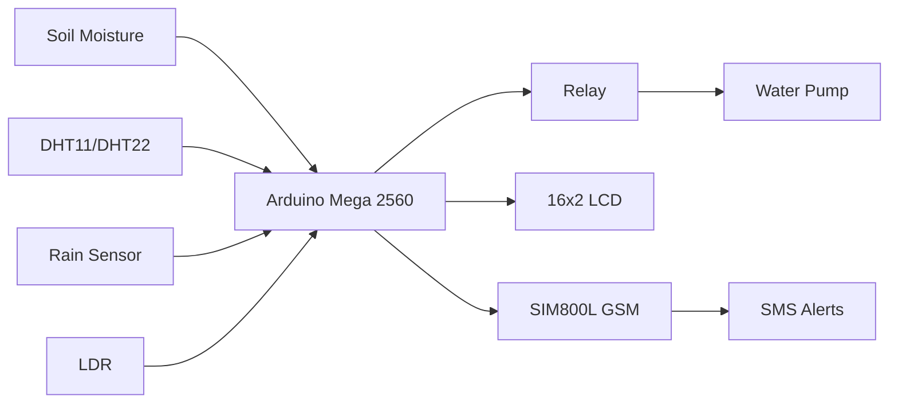
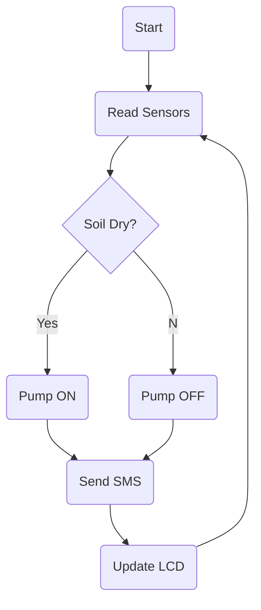

# SAKSHAM

## Smart Adaptive Knowledge-based Soil Hydration & Automation Module

> Developed by **Saswata Bag**  
> **SB.Chetak Innovation**

---

## Overview

SAKSHAM is an intelligent embedded irrigation system built around the **Original Arduino Mega 2560**. It monitors soil moisture, temperature, humidity, rainfall, and ambient light, and automatically controls irrigation using adaptive logic. A GSM module sends SMS notifications for important events such as irrigation status and rainfall detection.

## Features

- Automatic irrigation
- Soil moisture monitoring
- Temperature & humidity sensing
- Rain detection
- Ambient light sensing
- GSM SMS alerts
- Relay-controlled pump
- LCD status display
- Modular architecture

## System Architecture



## Workflow



## Hardware

- Original Arduino Mega 2560
- SIM800L/SIM900 GSM Module
- Soil Moisture Sensor
- DHT11/DHT22
- Rain Sensor
- LDR
- Relay Module
- DC Water Pump
- 16x2 I2C LCD

## Software

- Arduino IDE
- Embedded C/C++
- Arduino Libraries

## Repository Structure

```text
SAKSHAM/
├── Firmware/
├── Hardware/
├── Circuit_Diagram/
├── Documentation/
├── Images/
├── LICENSE
└── README.md
```

## Applications

- Smart Irrigation
- Home Gardens
- Greenhouses
- Research
- Education

## License

Copyright © 2026 SB.Chetak Innovation.

Licensed under the BagResearch License.

## Developer

**Saswata Bag**

Embedded Systems Engineer | IoT Developer | Hardware Innovator

Website: https://www.bagresearch.co.in

Email: projects@bagresearch.co.in
